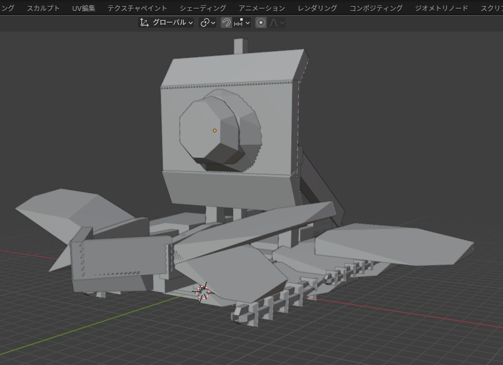
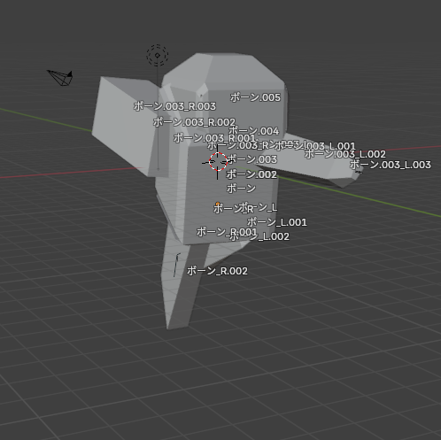
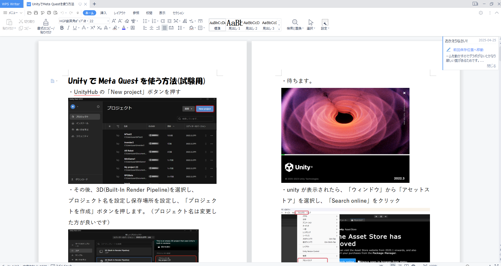
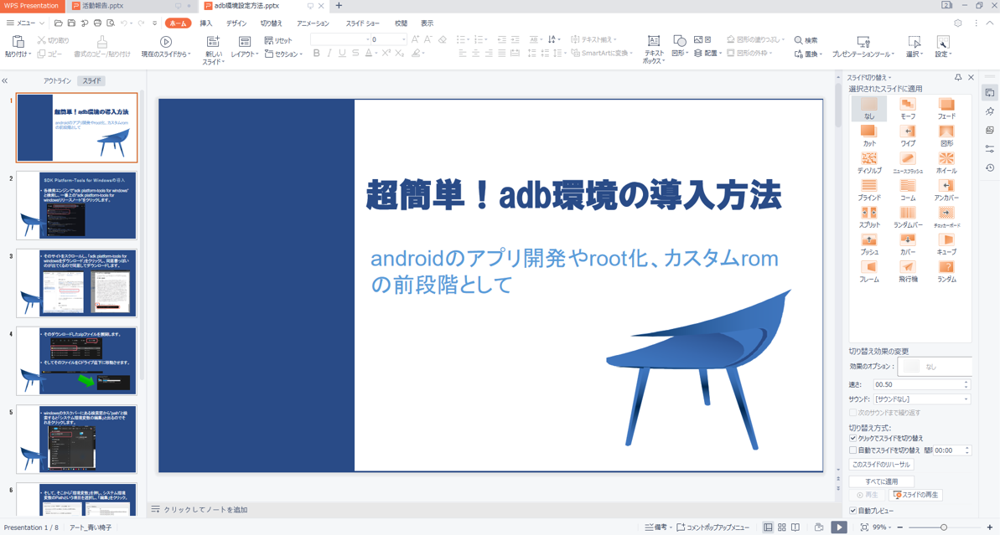
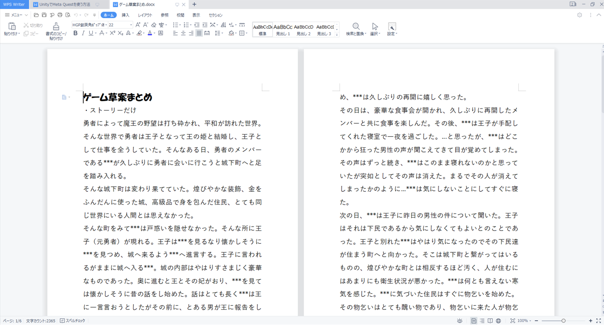
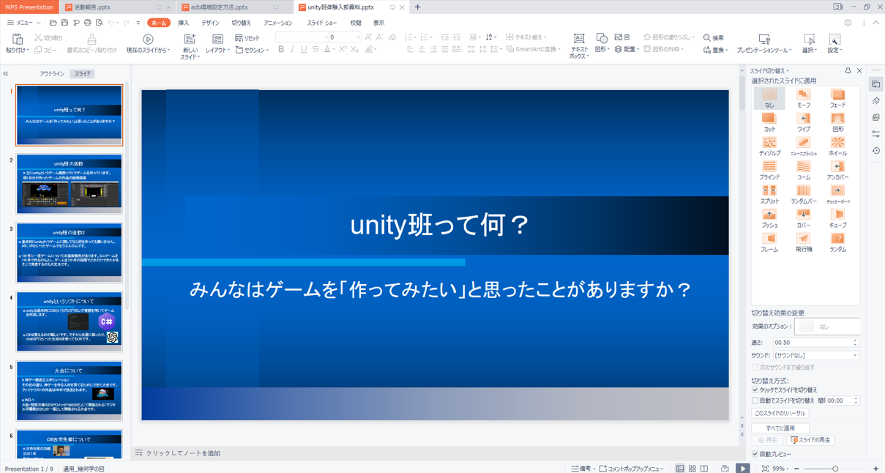
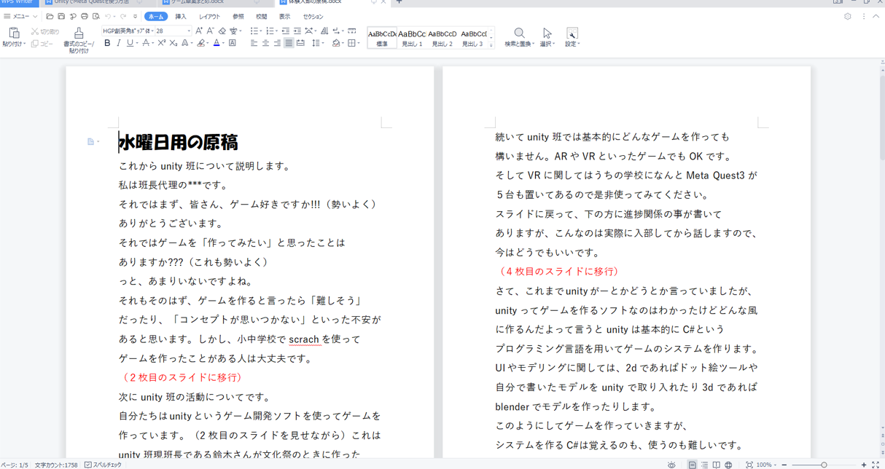

# 活動報告詳細

---

## ARゲームについて

* スコアを実装し、敵を１体倒すにつき100加算するようにしました。

* ゲーム画面を大幅に変更し、より画面が表示されるようにしました。

* ボスを追加し、そのモデリングをblenderで制作しました。

* 通常の敵にはblenderでアニメーションを勉強という名目で追加しました。

## github desktopについてのパワポ

* １，２年を対象としたgithub desktopを用いてunityのバージョン管理の方法を記したものです。近々講習をやりたいと思っています。

### 予定

|１年生|２年生|
|------|-----|
|まだgitを知らない人もいるかもしれないので  githubとはというところから丁寧に説明する|最初からgithub desktopをインストールさせる|
|未定|未定|

## Meta Questのunity使い方ガイド

* これは未完成でこれをそのまま実行してもうまくいきません。新しく作り直します。

## adb環境の導入方法のパワポ

* Meta Questでunityのゲームを作る際に必要になる作業なので別にまとめました。

## 新ゲームの草案（ストーリーのみ）

* 一応、ストーリーRPGにする予定でいます。

## 体験入部についてのあれこれ

### パワポ

* あんまり時間かけて作ってない物なので、アドリブのところがいくつもありました。

### 代役の台本

* 体験入部の最終日に来れなくなったので、代役のために資料に則った台本を作りました。

## まとめ

この１か月間いろいろとやってきましたが、unityよりもパワポやワードといったことに時間を割いてしまっていたため、次からはunityに切り替えていきたい。~~あと企画書書かないとね~~